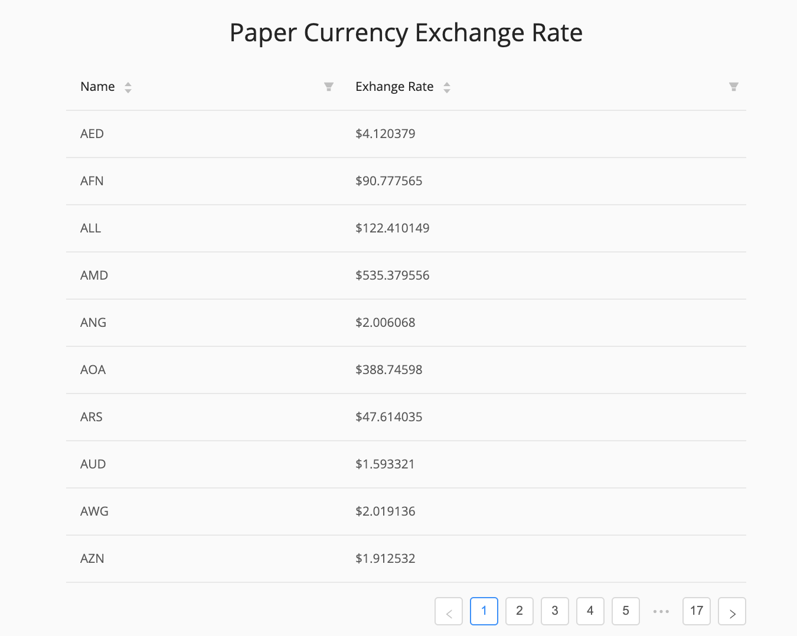
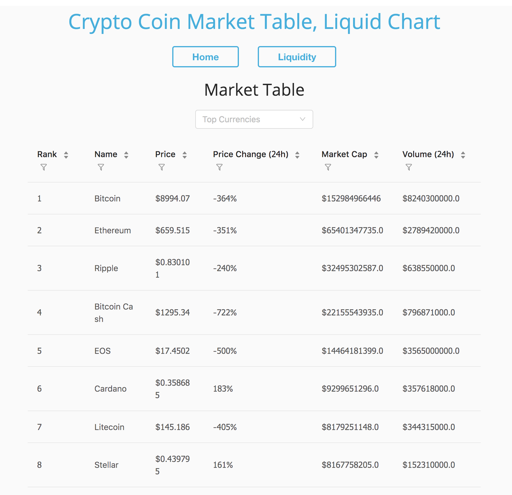
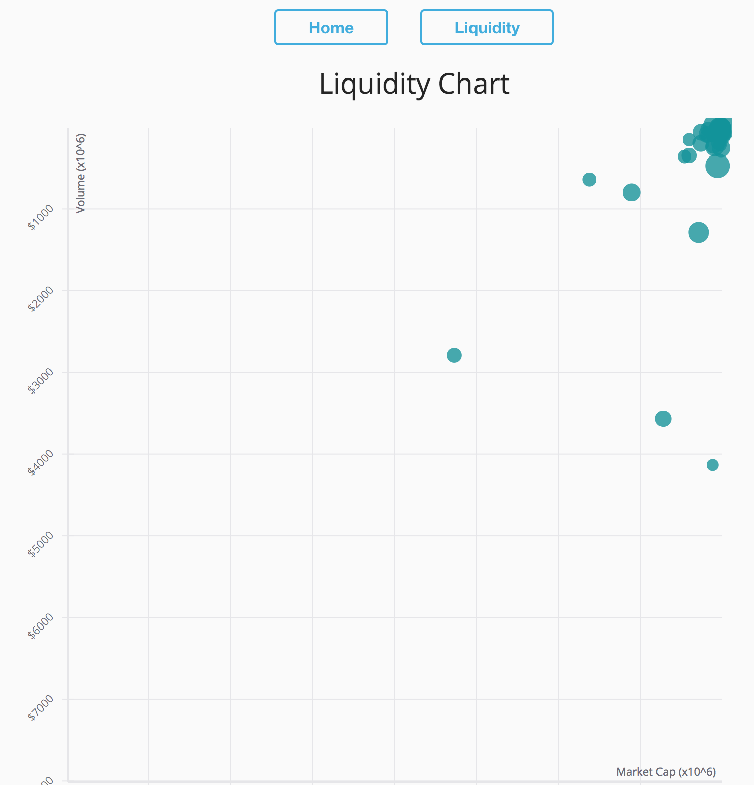
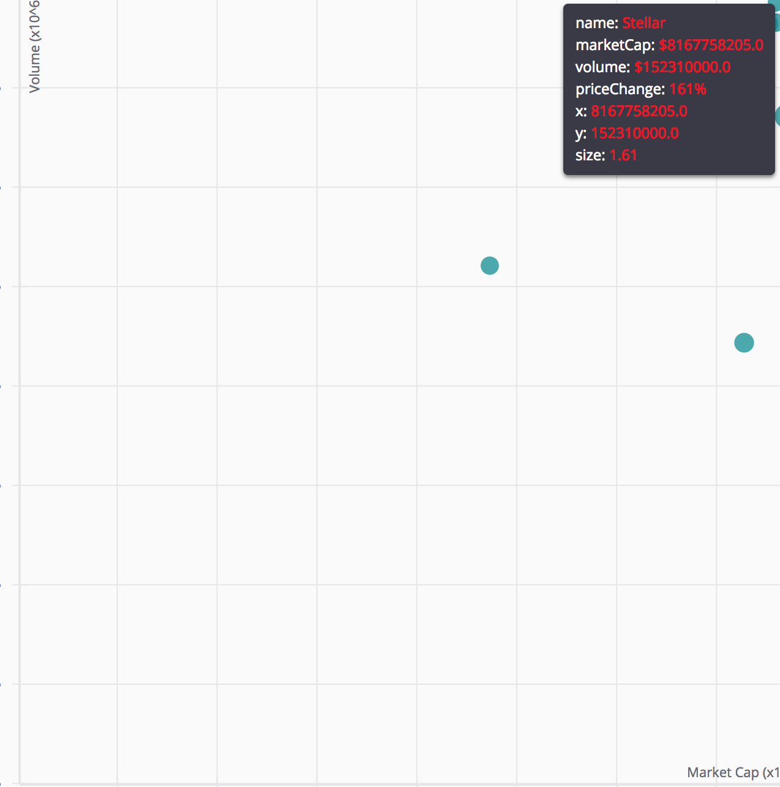

# Crypto Currency Market Analysis

**utilizes react-boilterplate --> Hence the `license` and `contributing` files**
Shows a Market Table and chart for data visualization.
Utilized various APIs, React w/ Redux, and Node.js

<h4> Paper currency exchange rate table </h4>


<h4> Market table </h4>


<h4> Liquidity Chart </h4>
</img> 

<h4> Example </h4>
</img> </img>

<br />

<div align="center"><strong> <br />Crypto Currency Market Analysis</strong></div>
</div>

## Motivation
To help JavaScript, React developers get started with Data Visualization, especially in Blockchain, Crypto Currency area.

## How to run
```
yarn
```
Then
```
yarn start
```
or
```
npm install
```
Then
```
npm start
```
More interesting data coming in soon...

## References
This project uses awesome @react-boilerplate  [react-boilerplate](https://github.com/react-boilerplate/react-boilerplate)
